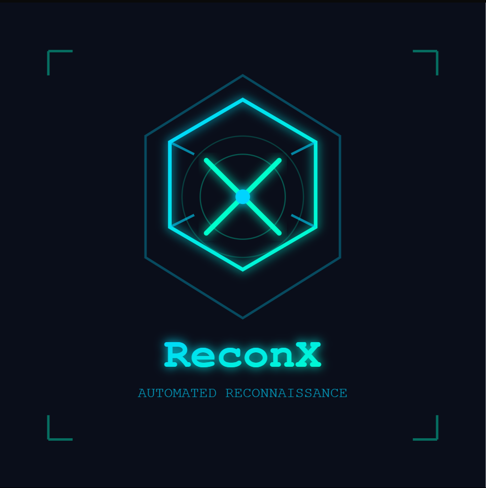
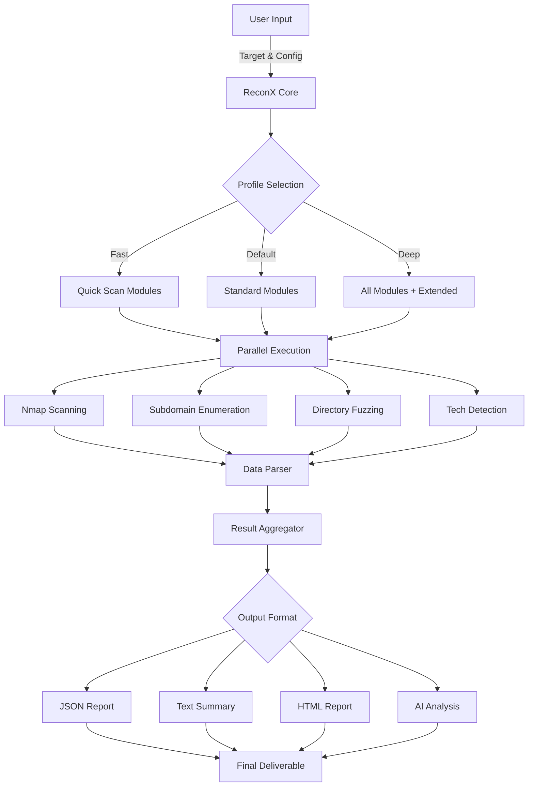

<div align="center">



# ReconX

### Next-Generation Automated Reconnaissance Framework


---

**[Features](#-features) • [Installation](#-installation) • [Usage](#-usage) • [Documentation](#-documentation) • [Contributing](#-contributing)**

---

</div>


## 📋 Overview

**ReconX** is an enterprise-grade, CLI-first reconnaissance automation toolkit designed for security professionals and penetration testers. It orchestrates multiple industry-standard security tools into a unified workflow, producing comprehensive, structured reports in multiple formats.

```ascii
┌─────────────────────────────────────────────────────────────┐
│  ReconX Pipeline                                            │
├─────────────────────────────────────────────────────────────┤
│                                                             │
│  Target Input  →  Multi-Tool Scanning  →  Data Aggregation  │
│       ↓                    ↓                      ↓         │
│   IP/Domain        Parallel Execution         JSON/HTML     │
│   CIDR Range       7+ Security Tools           Reports      │
│                                                             │
└─────────────────────────────────────────────────────────────┘
```

> ⚠️ **Legal Notice**: This tool is intended exclusively for authorized security assessments and educational purposes. Unauthorized network reconnaissance or penetration testing is illegal. Only use ReconX on systems you own or have explicit written permission to test.

---

## ✨ Features

<table>
<tr>
<td width="50%">

### 🔧 **Core Capabilities**

- **Multi-Tool Integration**  
  Seamlessly orchestrates Nmap, Subfinder, Gobuster, ffuf, WhatWeb, Nikto, and SQLMap

- **Intelligent Automation**  
  Parallel execution with smart dependency management

- **Flexible Profiles**  
  Fast, default, and deep scanning modes for different scenarios

- **Modular Design**  
  Enable/disable specific modules based on engagement scope

</td>
<td width="50%">

### 📊 **Advanced Features**

- **Multi-Format Reports**  
  JSON, plain text, and professional HTML reports

- **AI-Powered Analysis**  
  Optional local AI summaries via Ollama integration

- **Preview Mode**  
  Dry-run capability to review commands before execution

- **Custom Configuration**  
  Flexible wordlists, thread counts, and API integration

</td>
</tr>
</table>

---

## 🏗️ Architecture

```
┌─────────────────────────────────────────────────────────────┐
│                        ReconX Core                          │
├─────────────────────────────────────────────────────────────┤
│                                                             │
│  ┌──────────┐  ┌──────────┐  ┌──────────┐  ┌──────────┐     │
│  │   Nmap   │  │ Subfinder│  │ Gobuster │  │   ffuf   │     │
│  └────┬─────┘  └────┬─────┘  └────┬─────┘  └────┬─────┘     │
│       │             │             │             │           │
│  ┌────┴─────┐  ┌────┴─────┐  ┌────┴─────┐  ┌────┴─────┐     │
│  │ WhatWeb  │  │  Nikto   │  │  SQLMap  │  │ URLScan  │     │
│  └────┬─────┘  └────┬─────┘  └────┬─────┘  └────┬─────┘     │
│       │             │             │             │           │
│       └─────────────┴─────────────┴─────────────┘           │
│                          ↓                                  │
│              ┌───────────────────────┐                      │
│              │   Parser & Aggregator │                      │
│              └───────────┬───────────┘                      │
│                          ↓                                  │
│              ┌───────────────────────┐                      │
│              │   Report Generator    │                      │
│              │  JSON | TXT | HTML    │                      │
│              └───────────────────────┘                      │
│                                                             │
└─────────────────────────────────────────────────────────────┘
```

### 📁 Project Structure

```
recony/
├── 📄 README.md
├── ⚙️ config.ini.example          # API keys configuration
├── 📦 setup.py
├── 📋 requirements.txt
├── 📂 reconx/
│   ├── __init__.py
│   ├── __main__.py                # CLI entrypoint
│   ├── 📂 lib/
│   │   ├── config.py              # Configuration handler
│   │   └── output.py              # Report generation engine
│   └── 📂 modules/                # Scanner modules
│       ├── nmap.py                # Port & service scanning
│       ├── subenum.py             # Subdomain enumeration
│       ├── dirfuzz.py             # Directory fuzzing
│       ├── ffuf.py                # Web fuzzing
│       ├── whatweb.py             # Technology detection
│       ├── nikto.py               # Vulnerability scanning
│       ├── sqlmap.py              # SQL injection testing
│       └── urlscan.py             # URL analysis
├── 📂 results/                    # Scan outputs
└── 📂 tests/                      # Unit tests
```

---

## 🚀 Installation

### Prerequisites

<table>
<tr>
<td width="33%">

**Operating System**
- Kali Linux (recommended)
- Ubuntu 20.04+
- Debian 11+

</td>
<td width="33%">

**Python Environment**
- Python 3.8+
- pip package manager
- virtualenv (optional)

</td>
<td width="33%">

**System Tools**
- Nmap 7.80+
- Go 1.16+ (for Subfinder)
- Internet connection

</td>
</tr>
</table>

### Step 1: Install System Dependencies

```bash
# Update package lists
sudo apt update && sudo apt upgrade -y

# Install core security tools
sudo apt install -y \
    nmap \
    gobuster \
    ffuf \
    whatweb \
    nikto \
    sqlmap \
    golang-go \
    git \
    python3-pip
```

### Step 2: Install Subfinder

```bash
# Install Subfinder via Go
go install -v github.com/projectdiscovery/subfinder/v2/cmd/subfinder@latest

# Add Go bin to PATH (add to ~/.bashrc for persistence)
export PATH=$PATH:$(go env GOPATH)/bin
```

### Step 3: Install ReconX

```bash
# Clone the repository
git clone https://github.com/DivyanshuSaini2112/recony.git

# Navigate to directory
cd recony

# Install ReconX and Python dependencies
pip install .

# Verify installation
reconx --help
```

### Step 4: Configure API Keys (Optional)

For enhanced functionality with URLScan and other services:

```bash
# Copy example configuration
cp config.ini.example config.ini

# Edit with your favorite editor
nano config.ini
```

**config.ini structure:**
```ini
[API_KEYS]
urlscan_api_key = your_urlscan_api_key_here
shodan_api_key = your_shodan_api_key_here
virustotal_api_key = your_virustotal_api_key_here
```

---

## 💻 Usage

### Basic Command Structure

```bash
reconx -t <TARGET> [OPTIONS]
```

### Command-Line Arguments

<table>
<thead>
<tr>
<th width="25%">Argument</th>
<th width="15%">Type</th>
<th width="60%">Description</th>
</tr>
</thead>
<tbody>
<tr>
<td><code>-t, --target</code></td>
<td>Required</td>
<td>Target specification: IP address, domain, or CIDR range</td>
</tr>
<tr>
<td><code>--modules</code></td>
<td>Optional</td>
<td>Comma-separated list: <code>nmap,subenum,dirfuzz,whatweb,nikto,sqlmap</code></td>
</tr>
<tr>
<td><code>--profile</code></td>
<td>Optional</td>
<td>Scan intensity: <code>fast</code> | <code>default</code> | <code>deep</code></td>
</tr>
<tr>
<td><code>--fuzzer</code></td>
<td>Optional</td>
<td>Directory fuzzer selection: <code>gobuster</code> | <code>ffuf</code></td>
</tr>
<tr>
<td><code>--threads</code></td>
<td>Optional</td>
<td>Number of concurrent threads (default: 10)</td>
</tr>
<tr>
<td><code>--wordlist</code></td>
<td>Optional</td>
<td>Custom wordlist path for directory fuzzing</td>
</tr>
<tr>
<td><code>--out</code></td>
<td>Optional</td>
<td>Output directory (default: <code>./results</code>)</td>
</tr>
<tr>
<td><code>--html</code></td>
<td>Flag</td>
<td>Generate professional HTML report</td>
</tr>
<tr>
<td><code>--ai-summary</code></td>
<td>Flag</td>
<td>Generate AI-powered analysis (requires Ollama)</td>
</tr>
<tr>
<td><code>--no-exec</code></td>
<td>Flag</td>
<td>Preview mode: display commands without executing</td>
</tr>
<tr>
<td><code>-v, --verbose</code></td>
<td>Flag</td>
<td>Enable verbose output</td>
</tr>
</tbody>
</table>

### 📚 Usage Examples

#### Quick Start

```bash
# Basic reconnaissance scan
reconx -t example.com
```

#### Full Assessment

```bash
# Comprehensive scan with all modules and reports
reconx -t example.com \
    --profile default \
    --modules nmap,subenum,dirfuzz,whatweb,nikto \
    --html \
    --ai-summary \
    --threads 20
```

#### Fast Scan

```bash
# Rapid assessment with essential modules
reconx -t 192.168.1.0/24 \
    --profile fast \
    --modules nmap,dirfuzz \
    --threads 50
```

#### Deep Dive

```bash
# Extensive reconnaissance with maximum depth
reconx -t example.com \
    --profile deep \
    --modules nmap,subenum,dirfuzz,whatweb,nikto,sqlmap \
    --wordlist /usr/share/wordlists/dirbuster/directory-list-2.3-medium.txt \
    --html \
    --ai-summary
```

#### Preview Mode

```bash
# Review commands before execution
reconx -t example.com \
    --modules nmap,subenum,dirfuzz \
    --no-exec
```

#### Custom Configuration

```bash
# Tailored scan with specific parameters
reconx -t example.com \
    --modules nmap,dirfuzz,whatweb \
    --fuzzer ffuf \
    --threads 30 \
    --wordlist /path/to/custom-wordlist.txt \
    --out /home/user/recon-results \
    --verbose
```

---

## 📊 Output & Reports

### Report Structure

Each scan generates a timestamped directory containing multiple output formats:

```
results/example.com-2025-11-14_15-30-45/
├── 📄 reconx_results.json         # Primary aggregated data (JSON)
├── 📄 summary.txt                 # Human-readable executive summary
├── 🌐 report.html                 # Professional HTML report
├── 🤖 ai_summary.txt              # AI-generated analysis
├── 📄 nmap_quick_scan.xml         # Nmap quick scan results
├── 📄 nmap_detailed_scan.xml      # Nmap comprehensive scan
├── 📄 subdomains.txt              # Discovered subdomains
├── 📄 dirfuzz.txt                 # Directory fuzzing results
├── 📄 whatweb.json                # Technology stack detection
└── 📄 nikto.txt                   # Web server vulnerabilities
```

### Sample Report Preview

**summary.txt:**
```
═══════════════════════════════════════════════════════════
                    ReconX Scan Summary
═══════════════════════════════════════════════════════════

Target:         example.com
Scan Date:      2025-11-14 15:30:45
Profile:        default
Duration:       12m 34s

─────────────────────────────────────────────────────────────
📊 Findings Overview
─────────────────────────────────────────────────────────────

Open Ports:     22/tcp, 80/tcp, 443/tcp
Subdomains:     12 discovered
Directories:    47 accessible paths found
Technologies:   Apache 2.4.52, PHP 8.1, MySQL

─────────────────────────────────────────────────────────────
🔍 Key Discoveries
─────────────────────────────────────────────────────────────

[+] Port 443: TLS certificate valid until 2026-05-15
[+] Subdomain: admin.example.com (high priority)
[+] Directory: /api/v1/ (200 OK)
[!] Nikto: Outdated Apache version detected
```

---

## 🔄 Workflow & Methodology



---

## 🧪 Testing & Quality Assurance

### Running Tests

```bash
# Run all unit tests
python -m unittest discover -v

# Run with pytest (if installed)
pytest -v

# Run with coverage report
coverage run -m pytest
coverage report -m
```

### Test Coverage

- ✅ Module initialization
- ✅ Command generation
- ✅ Output parsing
- ✅ Error handling
- ✅ Configuration validation
- ✅ Report generation

---

## 🤝 Contributing

We welcome contributions from the community! Here's how you can help:

### Contribution Workflow

1. **Fork** the repository
2. **Create** a feature branch  
   ```bash
   git checkout -b feature/amazing-feature
   ```
3. **Develop** your feature with tests
4. **Commit** your changes  
   ```bash
   git commit -m 'Add amazing feature'
   ```
5. **Push** to your branch  
   ```bash
   git push origin feature/amazing-feature
   ```
6. **Open** a Pull Request

### Development Guidelines

- Follow PEP 8 style guide for Python code
- Add unit tests for new features
- Update documentation for API changes
- Ensure all tests pass before submitting PR
- Write clear, descriptive commit messages

### Areas for Contribution

- 🐛 Bug fixes and improvements
- 📝 Documentation enhancements
- 🔧 New scanner modules
- 🎨 UI/UX improvements
- 🌐 Internationalization
- 🧪 Test coverage expansion

---

## 📖 Documentation

### Additional Resources

- **[Wiki](https://github.com/DivyanshuSaini2112/recony/wiki)** - Comprehensive guides and tutorials
- **[API Documentation](https://github.com/DivyanshuSaini2112/recony/wiki/API)** - Module development guide
- **[FAQ](https://github.com/DivyanshuSaini2112/recony/wiki/FAQ)** - Frequently asked questions
- **[Troubleshooting](https://github.com/DivyanshuSaini2112/recony/wiki/Troubleshooting)** - Common issues and solutions

---

## 🙏 Acknowledgments

ReconX stands on the shoulders of giants. Special thanks to:

<table>
<tr>
<td width="50%">

**Security Tools**
- **Nmap** - Gordon "Fyodor" Lyon
- **Subfinder** - ProjectDiscovery Team
- **Gobuster** - OJ Reeves
- **ffuf** - Joona Hoikkala

</td>
<td width="50%">

**Additional Tools**
- **WhatWeb** - Andrew Horton
- **Nikto** - Chris Sullo & David Lodge
- **SQLMap** - Bernardo Damele & Miroslav Stampar
- **Ollama** - Ollama Team

</td>
</tr>
</table>

---

## 📜 License

This project is licensed under the **MIT License** - see the [LICENSE](LICENSE) file for full details.

```
MIT License

Copyright (c) 2025 Divyanshu Saini

Permission is hereby granted, free of charge, to any person obtaining a copy
of this software and associated documentation files...
```

---

## 📞 Contact & Support

<div align="center">

**Developer**: [Divyanshu Saini](https://github.com/DivyanshuSaini2112)

[](https://github.com/DivyanshuSaini2112)
[](https://linkedin.com/in/divyanshusaini2112)
[](https://x.com/DivyanshuS72153)

### Support the Project

If ReconX has been valuable to your security assessments, consider:

⭐ **Star** the repository  
🐛 **Report** issues  
🤝 **Contribute** code  
📢 **Share** with the community

</div>

---

<div align="center">

### ⚡ Happy Hacking! ⚡

**Remember: With great power comes great responsibility.**  
Always obtain proper authorization before testing any system.

---

*Built with ❤️ for the security community*

</div>
